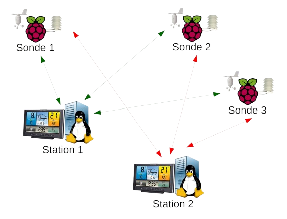

<h1 align="center">
  
</h1>

## Weather Station 🌦️

    

## Project Overview

This project aims to create a weather station that collects and displays meteorological data. It is hosted on a **Raspberry Pi** in our classroom with real and fake sensors.
The measures are stored in an InfluxDB database and visualised using a Vue.js frontend. Interoperability is necessary here, each project needs to be able to collect, use and send data to our classmates with similar projects.

## Table of contents
* [Features & Use](#features--use)
* [Possible Improvment](#possible--improvement)

## Features & Use

Thanks to our project, you can visit our website to see and observe the weather **all over the world**. All you have to do is type [http://piensg031.ensg.eu:3000/](http://piensg031.ensg.eu:3000/) into your browser. When you land on the home page, you can choose to access either **live view** measurements or some data for the period you want to observe through **sample view**.

### Live View
Here you can view live data, select the measurements and stations you wish to view and the most recent data will be displayed on the screen. You will also see a map showing the location of the station if you choose to see it.

### Sample View
This section allows you to select a specific time period to view historical data. You can filter the data by date and time to analyse past weather conditions. The data is presented as graphs, and by selecting multiple stations you can view data from the same sensors on a unique graph.

## Possible Improvment

* The first improvement that could be made is visual. A more stable colour palette would make the dashboard more accessible and readable. Also, some charts are not relevant. An example is the position radar chart, which
which takes up a lot of space for a small variation.

* TThen the aggregation of the data on the charts will be done automatically, depending on the time difference between the start and the end. However, an option could be added to allow the user to choose the scale of aggregation. This could affect the speed of loading, but will be more relevant to the user as it will be closer to their preference.

* Again on the visual side, we could offer a choice for the background map when it is displayed. This is also linked to the possibility of implementing a dark mode for the site, making it more pleasant and customisable.

* Some features can also be updated. The live view is live when you load it, but isn't updated as new data becomes available, and the same could be done with the sample view if the end date is missing.

* If this project were for external use, scalability, resilience and high availability would be the priority. But in our case, only a small part of the resilience would work. In fact, if the machine holding the code, database and services had a critical problem, it could be restarted, but if the physical device was destroyed, nothing would work at all.

<h1 align="center">
  
</h1>
